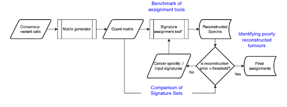

#  

[](https://nf-co.re/icgcargomutsig/results)[](https://doi.org/10.5281/zenodo.XXXXXXX)

[](https://www.nextflow.io/)
[](https://docs.conda.io/en/latest/)
[](https://www.docker.com/)
[](https://sylabs.io/docs/)
[](https://tower.nf/launch?pipeline=https://github.com/nf-core/icgcargomutsig)

[](https://nfcore.slack.com/channels/icgcargomutsig)[](https://twitter.com/nf_core)[](https://mstdn.science/@nf_core)[](https://www.youtube.com/c/nf-core)

## Introduction

**nf-core/icgcargomutsig** is a bioinformatics pipeline that can be used to convert GDC MAF files or a collection of VCF files into mutational count matrices and performs both signature assignment using SigProfiler and signature.tools.lib and calculates error statistics for the assignment performance.



1. Generate SBS96, DBS78 and ID83 count matrices using ([`SigProfilerMatrixgenerator`](https://osf.io/s93d5/wiki/home/))
2. Assessment of row orders to ensure full compatibility between the reference catalogues of each assignment tool and the input data.
3. Assignment of SBS signatures to the COSMIC mutational signature catalogue using ([`SigProfilerExtractor`](https://osf.io/t6j7u/wiki/home/)) and ([`signature.tools.lib`](https://github.com/Nik-Zainal-Group/signature.tools.lib))
4. Calculation of error thresholds using Kullback-Leibler divergence, root-square mean error, sum of absolute distances and Hellinger Distance.
5. Generation of a ([`MultiQC`](https://multiqc.info/)) report containing run information and log data.

## Usage

For more details and a quick start guide, please refer to the [usage documentation](https://nf-co.re/icgcargomutsig/usage) and the [parameter documentation](https://nf-co.re/icgcargomutsig/parameters).

### Global options

- `--input` (**required**): **Absolute** path to your input MAF, matrix or the folder containing the VCFs for analysis
- `--output_pattern` (**required**): Output naming convention for the analysis
- `--outdir` (**required**): Relative or absolute path to the desired output destination

### SigProfiler tool options (SigProfiler Matrixgenerator and Assignment)

- `--filetype` (**required**): Defines which input type is passed to the SigProfiler tools, currently supported options are `'MAF'`, `'Matrix'` or `'VCF'`
- `--ref` (**required**): Defines the reference genome from which the data was generated, currently supported options include `'GRCh37'` and `'GRCh38'`
- `--exome`: This flag defines if the SigProfiler tools should run against the COSMIC exome/panel reference instead of the WGS reference, activate with `--exome true`. [default: ```false```]
- `--context`: Defines which sequence context types should be assigned to the respective COSMIC catalogues for the SigProfiler Assignment module. Valid options include `"96", "288", "1536", "DINUC", and "ID"`. Running the pipeline with default parameters will perform only SBS96 signature assignment. [default: ```'96'```]

### signature.tools.lib options

- `--n_boots`: Defines how many NMF iterations should be performed by signature.tools.lib Fit before the model converges. [default: `100`]

> **Note**
> If you are new to Nextflow and nf-core, please refer to [this page](https://nf-co.re/docs/usage/installation) on how
> to set-up Nextflow. Make sure to [test your setup](https://nf-co.re/docs/usage/introduction#how-to-run-a-pipeline)
> with `-profile test` before running the workflow on actual data.

> **Warning:**
> Please provide pipeline parameters via the CLI or Nextflow `-params-file` option. Custom config files including those
> provided by the `-c` Nextflow option can be used to provide any configuration _**except for parameters**_;
> see [docs](https://nf-co.re/usage/configuration#custom-configuration-files).

## Frequently Asked Questions and known "bugs":

- The Error Thresholding Module breaks die to the error `Error: dims [product 31] do not match the length of object [96]`:
  A border case for the mutational signature assignment pipeline is providing a single sample for analysis. As the error thresholding module expects a matrix as input for calculating error statistics, a single sample would will be parsed as a vector and thus break the analysis. Please provide more than a single sample to the pipeline to circumvent this error.

- The Error Thresholding Module breaks due to a `lexical error` in the `read_json` step:
  This error occurs due to a "lower bound limitation" of mutations per sample which are required for _signature.tools.lib_ to fully assign the input activities to all reference signatures without producing `ǸaN` values. We haven't tested the full spectrum for identification of the lower bound for our pipeline, but would recommend to only provide data with at least 50 mutations per sample.

## Pipeline output

To see the results of an example test run with a full size dataset refer to the [results](https://nf-co.re/icgcargomutsig/results) tab on the nf-core website pipeline page.
For more details about the output files and reports, please refer to the
[output documentation](https://nf-co.re/icgcargomutsig/output).

## Credits

We thank the following people for their extensive assistance in the development of this pipeline:

- Lancelot Seillier
- Paula Stancl
- Felix Beaudry
- Sandesh Memane
- Shawn Zamani
- Alvin Ng
- Linda Xiang
- Kjong Lehmann

## Contributions and Support

If you would like to contribute to this pipeline, please see the [contributing guidelines](.github/CONTRIBUTING.md).

## Citations

An extensive list of references for the tools used by the pipeline can be found in the [`CITATIONS.md`](CITATIONS.md) file.

You can cite the `nf-core` publication as follows:

> **The nf-core framework for community-curated bioinformatics pipelines.**
>
> Philip Ewels, Alexander Peltzer, Sven Fillinger, Harshil Patel, Johannes Alneberg, Andreas Wilm, Maxime Ulysse Garcia, Paolo Di Tommaso & Sven Nahnsen.
>
> _Nat Biotechnol._ 2020 Feb 13. doi: [10.1038/s41587-020-0439-x](https://dx.doi.org/10.1038/s41587-020-0439-x).
